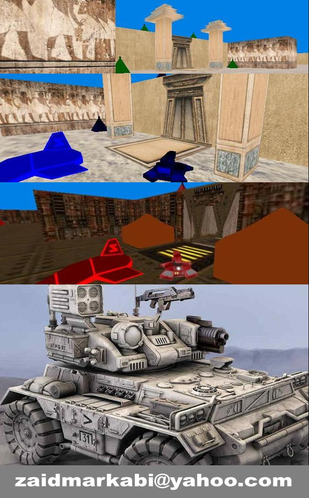



## Phantomatic TanK

### Description

3D Game and 2 players, new idea for games , and the computer playing with you..

See my great game and get it now..

Game's Idea :

[1]

Every player has base.

[2]

Every player have Money, Health , Two Weapons and Ammunition.

[3]

The first weapon is Shotgun, It's used for far goals.

The Second is Ball around you , It's powerful but used for side goals.

The second weapon uses 10 ammunitions, but the first weapon uses single ammunition..

You can change your weapon by pressing [ X ] or [ Num4 ] for each player.

[4]

If you died, and your health became zero, you will live again but you will lost [ 10 $ ] from your money and the other player will have [ + 10 $ ].

If you don't have money to pay, your money will become zero and you won't lose the game!

[5]

When you lose the game ?

Every player can buy Friendly Tank from his base.

To do that , stand beside the base and press [ E ] or [ Num1 ] for each player, but it costs [ 1 $ ] .

you can buy friendly tanks as you want! one,two or more...

The friendly tanks will go to opponent base..

and if any friendly tank reached to opponent base ,the other player will lost the game!!

but the friendly tanks have health also, and you should defend them.

To buy powerful friendly tanks, press [ Z ] or [ Num3 ] but it costs [ 50 $ ] .

[6]

What about Small Green Bases?

You will see in the game, small green bases ..

you can make them attack with you by stand beside them and press [ Left Ctrl ] or [ Right Ctrl ] for both players..

and if you are the RED team , the small green bases will be colored with red.

and also if you are the BLUE team,the small green bases will be colored with blue.

If any friendly tank from Red team ,walk beside the small blue bases , the small bases will attack the tank..

and you should know , the friendly tanks can't attack any one..

It's used to win the game only..

and so forth, the game is really interesting..

if you have any suggesting, let me hear you at

----

zaidmarkabi@yahoo.com

----

thanks,

Zaid Markabi
 
### More Info
 

             |
---                |---
**Submitted On**   |2008-09-28 13:51:00
**By**             |[Zaid Markabi](https://github.com/Planet-Source-Code/PSCIndex/blob/master/ByAuthor/zaid-markabi.md)
**Level**          |Advanced
**User Rating**    |4.9 (34 globes from 7 users)
**Compatibility**  |VB 5\.0, VB 6\.0
**Category**       |[Games](https://github.com/Planet-Source-Code/PSCIndex/blob/master/ByCategory/games__1-38.md)
**World**          |[Visual Basic](https://github.com/Planet-Source-Code/PSCIndex/blob/master/ByWorld/visual-basic.md)
**Archive File**   |[Phantomati2129139302008\.zip](https://github.com/Planet-Source-Code/zaid-markabi-phantomatic-tank__1-71168/archive/master.zip)

